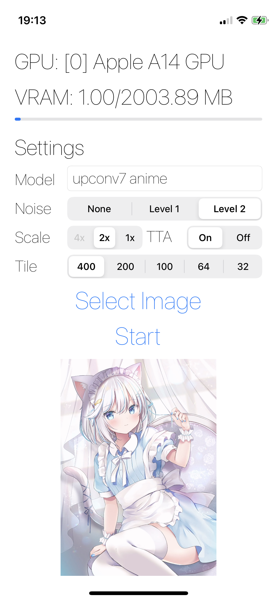

# Waifu2x iOS

Free and easy to use waifu2x application on iOS.


This software is only free and open to users who believe in free speech and stand with Hong Kong. Anyone believes in CCP or supports CCP in any means is NOT allowed to use or distribute this software in any form. 
## Screenshot





### TODO
- [ ] Video support? (but seriously, would anyone really do this on iPhone / iPad? It's gonna be thermal throttled a lot)

### Compile

```bash
# clone this repo
git clone --depth=1 https://github.com/BlueCocoa/waifu2x-ios
cd waifu2x-ios && export SRCROOT=`pwd`

# download and unarchive Vuklan SDK for macOS to ${SRCROOT}/Vulkan_SDK
# at the time of writing, latest SDK is https://vulkan.lunarg.com/sdk/home#sdk/downloadConfirm/1.2.154.0/mac/vulkansdk-macos-1.2.154.0.dmg
https://vulkan.lunarg.com/sdk/home#mac
```

Also you need to set the code sign in Xcode.

Then you can build `waifu2x-ios` with Xcode in either GUI mode or by invoking `xcodebuild` in terminal.

You might encounter some errors (see example below) at the first couple of compiling tries. (Because CMake needs to generate some files). Just ignore the errors and try to compile 2-4 times, it should be alright.

```
error: Build input file cannot be found: '/Users/cocoa/src/waifu2x-ios/waifu2x-ncnn-vulkan/src/ncnn/build-apple/src/layer/arm/unaryop_arm_arm82.cpp' (in target 'ncnn' from project 'ncnn')
```

The run script is baked in Xcode project, basically, it does these work for you.

```bash
# setup environment variables
export VULKAN_SDK="${SRCROOT}/VulkanSDK"
export VULKAN_LIB="${VULKAN_SDK}/MoltenVK/MoltenVK.xcframework/ios-arm64/libMoltenVK.a"

if [ ! -e "${VULKAN_LIB}" ]; then
    echo "Please download and unarchive VulkanSDK to ${VULKAN_SDK}."
    exit -1
fi

echo "[+] Recursive downloading dependences..."
if [ ! -d "${SRCROOT}/waifu2x-ncnn-vulkan/src/ncnn/build-apple" ]; then
    cd "${SRCROOT}/waifu2x-ncnn-vulkan"
    git submodule update --init --recursive
    mkdir -p "${SRCROOT}/waifu2x-ncnn-vulkan/src/ncnn/build-apple"
    cd "${SRCROOT}/waifu2x-ncnn-vulkan/src/ncnn/build-apple"
    cmake -GXcode -DCMAKE_BUILD_TYPE=Release \
        -DNCNN_BUILD_BENCHMARK=OFF \
        -DNCNN_BUILD_TESTS=OFF \
        -DNCNN_BUILD_TOOLS=OFF \
        -DNCNN_BUILD_EXAMPLES=OFF \
        -DCMAKE_TOOLCHAIN_FILE="${SRCROOT}/waifu2x-ncnn-vulkan/src/ncnn/toolchains/ios.toolchain.cmake" \
        -DIOS_PLATFORM=OS64 \
        -DIOS_DEPLOYMENT_TARGET=11.0 \
        -DVulkan_LIBRARY="${VULKAN_LIB}" \
        -DVulkan_INCLUDE_DIR="${VULKAN_SDK}/MoltenVK/include" \
        -DNCNN_VULKAN=ON \
        ..
fi

# waifu2x-ncnn-vulkan
# generate shader spv hex files
if [ ! -d "${SRCROOT}/waifu2x-ncnn-vulkan/src/gen-shader-spv-hex" ]; then
    cp -rf "${SRCROOT}/waifu2x-ncnn-vulkan-shader-spv-hex" "${SRCROOT}/waifu2x-ncnn-vulkan/src/gen-shader-spv-hex"
    cd "${SRCROOT}/waifu2x-ncnn-vulkan/src/gen-shader-spv-hex"
    mkdir -p build-shader && cd build-shader
    VULKAN_SDK="${SRCROOT}/VulkanSDK/macOS" cmake \
        -DVulkan_LIBRARY="${VULKAN_LIB}" \
        -DVulkan_INCLUDE_DIR="${VULKAN_SDK}/MoltenVK/include" \
        -DCMAKE_TOOLCHAIN_FILE="${SRCROOT}/waifu2x-ncnn-vulkan/src/ncnn/toolchains/ios.toolchain.cmake" \
        -DIOS_PLATFORM=OS64 \
        -DIOS_DEPLOYMENT_TARGET=11.0 \
        ..
    cmake --build .
    cp -f *.h "${SRCROOT}/waifu2x-ios"
fi

cd "${SRCROOT}"
git submodule update realsr-ncnn-vulkan 
# realsr-ncnn-vulkan
# generate shader spv hex files
if [ ! -d "${SRCROOT}/realsr-ncnn-vulkan/src/gen-shader-spv-hex" ]; then
    cp -rf "${SRCROOT}/realsr-ncnn-vulkan-shader-spv-hex" "${SRCROOT}/realsr-ncnn-vulkan/src/gen-shader-spv-hex"
    cd "${SRCROOT}/realsr-ncnn-vulkan/src/gen-shader-spv-hex"
    mkdir -p build-shader && cd build-shader
    VULKAN_SDK="${SRCROOT}/VulkanSDK/macOS" cmake \
        -DVulkan_LIBRARY="${VULKAN_LIB}" \
        -DVulkan_INCLUDE_DIR="${VULKAN_SDK}/MoltenVK/include" \
        -DCMAKE_TOOLCHAIN_FILE="${SRCROOT}/waifu2x-ncnn-vulkan/src/ncnn/toolchains/ios.toolchain.cmake" \
        -DIOS_PLATFORM=OS64 \
        -DIOS_DEPLOYMENT_TARGET=11.0 \
        ..
    cmake --build .
    cp -f *.h "${SRCROOT}/waifu2x-ios"
fi

mkdir -p "${SRCROOT}/waifu2x-ios/models"
copy_models() {
    if [ ! -d "${SRCROOT}/waifu2x-ios/models/$1" ]; then
        cp -rf "$2/$1" "${SRCROOT}/waifu2x-ios/models/$1"
    fi
}
copy_models "models-cunet" "${SRCROOT}/waifu2x-ncnn-vulkan/models"
copy_models "models-upconv_7_photo" "${SRCROOT}/waifu2x-ncnn-vulkan/models"
copy_models "models-upconv_7_anime_style_art_rgb" "${SRCROOT}/waifu2x-ncnn-vulkan/models"
copy_models "models-DF2K" "${SRCROOT}/realsr-ncnn-vulkan/models"
copy_models "models-DF2K_JPEG" "${SRCROOT}/realsr-ncnn-vulkan/models"
```

## Notice
RealSR can take a significant amount of time, the estimated time may not be accurate as the device may be throttled by thermal conditions. Also, at the time of writing, the largest selectable `tilesize` for RealSR on iPhone 11 Pro Max is 100.

## Acknowledgement

1. SVProgressHUD - https://github.com/SVProgressHUD/SVProgressHUD
2. waifu2x-ncnn-vulkan - https://github.com/nihui/waifu2x-ncnn-vulkan
2. realsr-ncnn-vulkan - https://github.com/nihui/realsr-ncnn-vulkan
3. libwebp - https://github.com/webmproject/libwebp.git
4. ncnn - https://github.com/Tencent/ncnn
5. glslang - https://github.com/KhronosGroup/glslang
6. Icon - https://www.flaticon.com/free-icon/zoom-in_3670592
